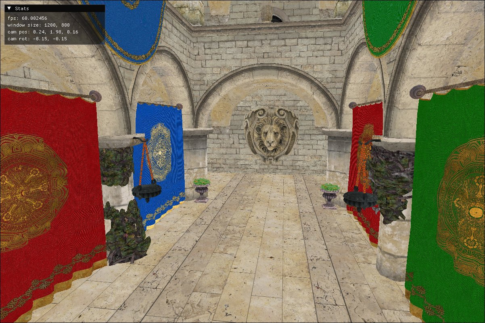
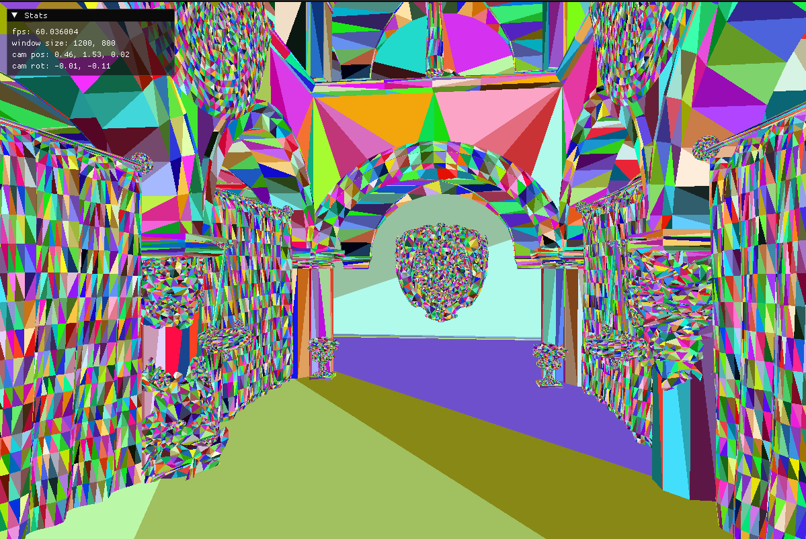
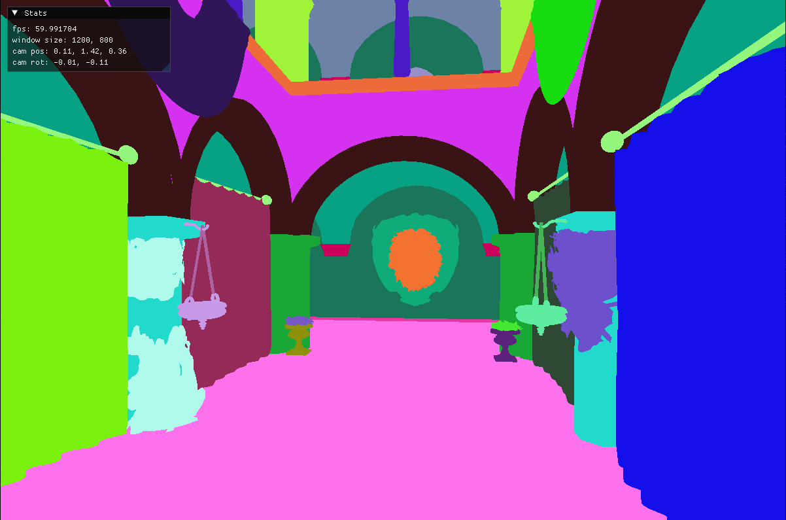

## はじめに
SlangとVulkanを用いてRaytracingを触ってみたメモ

### Slangとは?
最近話題の (?) シェーディング言語です。GLSLやHLSLと互換性を保ちつつ、Genericsやinterfaceなどのモダンなプログラミング機能を取り入れているのが特徴です。
生成できるターゲットは幅広く、GLSL、HLSL、SPIR-V、Metal、CUDA、WGSLに加えて、CPU向けのC++コードの生成にも対応しており、クロスプラットフォームかつバックエンド非依存なシェーダー開発を可能にします。
最近では、Sascha Willems 氏の [Vulkan サンプル集](https://github.com/SaschaWillems/Vulkan)でも、[GLSL/HLSL に加えて Slang が採用される](https://www.saschawillems.de/blog/2025/06/03/shaders-for-vulkan-samples-now-also-available-in-slang/)など、使用例が徐々に増えてきている印象です。
少し触ってみて感じたのは、SlangはHLSLやGLSLに比べて書いていてストレスが少ないということです。VSCode向けの拡張機能によるシンタックスハイライトもサポートされており、開発体験が快適なのも大きなポイントでしょう。
文法的にはHLSLに近く、GLSLに慣れていた自分としては最初は戸惑う部分もありましたが、慣れてくると書きやすく感じます。

Slang の特徴的な機能をいくつか紹介していきます。
####  1. Interface
structにinterfaceを持たせることができます。例えば、Light interfaceを定義して、それを実装するPointLight, AreaLightなどを作るという例が紹介されています
 ([Interfaces Design](https://github.com/shader-slang/slang/blob/master/docs/design/interfaces.md).)

```cpp
interface IFoo
{
    int MyMethod(float arg);
}

struct MyType : IFoo
{
    int MyMethod(float arg)
    {
        return (int)arg + 1;
    }
}
```


#### 2. Generics
GLSLには存在しなかった機能のひとつに、Genericsがあります。
HLSLでは[HLSL 2021](https://devblogs.microsoft.com/directx/announcing-hlsl-2021/)でtemplate機能が導入されており、これがそれに近い仕組みと言えるでしょう。

以下はGenericsを用いたコードの例です。頂点の各アトリビュートを補完するための関数になります
```cpp
T Interpolate<T : IFloat>(T v0, T v1, T v2, float2 uv) {
  let bary_u = T(uv.x);
  let bary_v = T(uv.y);
  let bary_w = T(1.0) - bary_u - bary_v;
  return v0 * bary_w + v1 * bary_u + v2 * bary_v;
}
```

こうして定義された関数は以下のように利用できます:
```cpp
let pos = Interpolate(v0.pos, v1.pos, v2.pos, attr.barycentrics);  // posはfloat3
let uv = Interpolate(v0.uv, v1.uv, v2.uv, attr.barycentrics);      // uvはfloat2
```
ジェネリクスを使うことで、同じロジックを複数の型に対して簡単に記述できて便利ですね

#### 3. Automatic Differentiation
自動微分を行うことができます。今回は深入りしませんが応用先は多そうです。

#### 4. Reflection
Reflectionを使うことによって、Vulkanコードとの整合性チェックやDescriptorSetLayoutなどの自動生成が可能になります。
[SPIRV-Cross](https://github.com/KhronosGroup/SPIRV-Cross)というおなじみのツールがあるので、もし複数のシェーダ言語をSPIR-Vに変換して扱う場合はこちらを使うのも良いでしょう。

## Vulkan + Slang Raytracing
実装していきます

### Slang-side
SlangでのRaytracingのコードを見てみましょう。今回はなるべくミニマルにコードを書きたいので、raygen shader, closest hit shader, miss shaderのみを使います。
また、今回のゴールはglTFファイルを読み込んでbase color textureを描画することにします。

#### 1. 使用する型の準備
まずは、glTFファイルを読み込むための型を定義します。
```cpp
// types.slang
typedef uint32_t Index;

struct Vertex {
  float3 pos;
  float3 normal;
  float2 uv;
  float4 color;
  float4 tangent;
};

struct Material {
  float4 base_color_factor;
  float metallic;
  float roughness;
  float3 emissive_factor;

  // textures (-1 means no texture)
  int base_color_texture_index;
  int normal_texture_index;
  int metallic_roughness_texture_index;
  int emissive_texture_index;
};

struct Texture {
  int image_index;
  int sampler_index;
};

struct GeometryNode {
  Vertex* vertices;
  Index* indices;
  int material_index;
};

struct CameraParams {
  float4 position;
  float4x4 world;
  float4x4 view_proj;
  float4x4 world_view_proj;
  float4x4 proj_to_world;
  float4x4 view_inverse;
  float4x4 proj_inverse;
};
```
`GeometryNode`は、各ジオメトリが持つ頂点データとインデックスデータ、そしてマテリアルへのインデックスを持つ型です。
ポインタは直感的に`Vertex*`と記述できるのが嬉しいですね。次に、Rayが持つpayloadを定義します。
```cpp
// ray_payload.slang

struct RayPayload {
  float3 color;
  float distance;
  float3 normal;

  __init() {
    color = float3(0.0, 0.0, 0.0);
    distance = 0.0;
    normal = float3(0.0, 0.0, 0.0);
  }
};
```
Slangでは`__init()`を用いて、structのコンストラクタを指定することができます。

#### 2. Raygen shader
Raygen shaderのbinding部分を見てみましょう
```cpp
// raygen.rgen.slang

#include "ray_payload.slang"
#include "types.slang"

// note: vk::binding(binding, set) という順番になる
// (set, binding) という順番ではないので注意
[[vk::binding(0, 0)]]
RaytracingAccelerationStructure tlas;

[[vk::binding(1, 0)]]
ConstantBuffer<CameraParams, Std140DataLayout> cam;

[[vk::binding(0, 1)]]
RWTexture2D<float4> result;
```

Bufferのバインディングにはデータのレイアウト (`Std140DataLayout`, `Std430DataLayout`, `ScalarDataLayout`) を指定することができます。これがcpp側とマッチしていないと結果がおかしくなるので注意です。
各レイアウトの説明は[Shader Memory Layout :: Vulkan Documentation Project](https://docs.vulkan.org/guide/latest/shader_memory_layout.html)が詳しいです。

raygen shaderの本体を見てみましょう。
```cpp
// raygen.rgen.slang つづき

// note: shaderの名前は`raygen`ではなく`raygeneration`
[shader("raygeneration")]
void main() {
  let subpixel_jitter = float2(0.5, 0.5);
  let launch_xy_idx = DispatchRaysIndex().xy;
  let launch_xy_size = DispatchRaysDimensions().xy;

  // ジッタを加えてピクセルの真ん中からレイを飛ばす
  let pixel_center = launch_xy_idx + subpixel_jitter;
  let uv = pixel_center / launch_xy_size;
  let ndc_coords = uv * 2.0 - 1.0;

  let origin = mul(cam.view_inverse, float4(0, 0, 0, 1));
  let target = mul(cam.proj_inverse, float4(ndc_coords.x, ndc_coords.y, 1, 1));
  let direction = mul(cam.view_inverse, float4(normalize(target.xyz), 0));

  var ray_payload = RayPayload();

  // Tmin = 0.01, Tmax = 1000.0とする
  let ray_desc = RayDesc(origin.xyz, 0.01, direction.xyz, 1000.0);

  // レイを飛ばす
  TraceRay(tlas, RAY_FLAG_FORCE_OPAQUE, 0xff, 0, 0, 0, ray_desc, ray_payload);

  // 出力先のフォーマットの関係でrgb -> bgrに変換
  result[launch_xy_idx] = float4(ray_payload.color.bgr, 1.0);
}
```
関数の名前が変わったくらいで、あとはHLSL/GLSLとほぼ同じです。

#### 3. Miss shader
Miss shaderは以下のようになります。
```cpp
// miss.rmiss.slang

#include "ray_payload.slang"

[shader("miss")]
void main(inout RayPayload payload) {
  payload.color = float3(0.3, 0.3, 0.3);
  payload.distance = -1.0;
  payload.normal = float3(0.0, 0.0, 0.0);
}
```
BVHにレイが当たらなかったとき、payloadに色: (0.3, 0.3, 0.3) を設定しています (今回は特にdistance, normalを設定する意味はなかったです) 。
GLSLでは関数の外にpayloadを宣言していましたが、Slangでは引数として渡さなければいけません

#### 4. Closest hit shader
まずはbinding部分を見てみましょう。
```cpp
// chit.rchit.slang

#include "ray_payload.slang"
#include "ray_payload.slang"
#include "types.slang"

[[vk::binding(1, 0)]]
ConstantBuffer<CameraParams, Std140DataLayout> cam;

[[vk::binding(1, 1)]]
StructuredBuffer<GeometryNode> geometry_nodes;

[[vk::binding(2, 1)]]
StructuredBuffer<Material, ScalarDataLayout> materials;

[[vk::binding(3, 1)]]
StructuredBuffer<Texture> textures;

[[vk::binding(0, 2)]]
Texture2D<float4> texture_images[];

[[vk::binding(1, 2)]]
SamplerState samplers[];
```
Arrayのバインディングは`Texture2D<float4> texture_images[];`のように、`[]`をつけて宣言します。


```cpp
// chit.rchit.slang つづき

T Interpolate<T : IFloat>(T v0, T v1, T v2, float2 uv) {
  let bary_u = T(uv.x);
  let bary_v = T(uv.y);
  let bary_w = T(1.0) - bary_u - bary_v;
  return v0 * bary_w + v1 * bary_u + v2 * bary_v;
}

Vertex InterpolateVertex(Vertex v0, Vertex v1, Vertex v2,
                         const BuiltInTriangleIntersectionAttributes attr) {
  Vertex result;
  result.pos = Interpolate(v0.pos, v1.pos, v2.pos, attr.barycentrics);
  result.normal = Interpolate(v0.normal, v1.normal, v2.normal, attr.barycentrics);
  result.uv = Interpolate(v0.uv, v1.uv, v2.uv, attr.barycentrics);
  result.color = Interpolate(v0.color, v1.color, v2.color, attr.barycentrics);
  result.tangent = Interpolate(v0.tangent, v1.tangent, v2.tangent, attr.barycentrics);
  return result;
}
```
先ほど説明したGenericsを用いて、頂点の各アトリビュートを補完する関数を定義しています。
最後に、closest hit shaderの本体を見てみましょう。

```cpp
// chit.rchit.slang つづき

[shader("closesthit")]
void main(inout RayPayload payload, in const BuiltInTriangleIntersectionAttributes attr) {
  payload.distance = RayTCurrent();

  let geometry_node = geometry_nodes[NonUniformResourceIndex(InstanceIndex())];

  let index1 = geometry_node.indices[NonUniformResourceIndex(PrimitiveIndex() * 3 + 0)];
  let index2 = geometry_node.indices[NonUniformResourceIndex(PrimitiveIndex() * 3 + 1)];
  let index3 = geometry_node.indices[NonUniformResourceIndex(PrimitiveIndex() * 3 + 2)];

  let v0 = geometry_node.vertices[NonUniformResourceIndex(index1)];
  let v1 = geometry_node.vertices[NonUniformResourceIndex(index2)];
  let v2 = geometry_node.vertices[NonUniformResourceIndex(index3)];

  let vertex = InterpolateVertex(v0, v1, v2, attr);

  let material_index = geometry_node.material_index;
  let material = materials[NonUniformResourceIndex(material_index)];

  // base color
  let base_color_texture_index = material.base_color_texture_index;
  if (base_color_texture_index != -1) {
    let texture = textures[NonUniformResourceIndex(base_color_texture_index)];
    let base_color_image = texture_images[NonUniformResourceIndex(texture.image_index)];
    payload.color =
        base_color_image
            .SampleLevel(samplers[NonUniformResourceIndex(texture.sampler_index)], vertex.uv, 0)
            .rgb;
  } else {
    payload.color = float3(0.0, 0.0, 0.0);
  }
}
```
GLSLでは`gl_PrimitiveID`を用いてprimitive indexを取得していましたが、Slangでは`PrimitiveIndex()`を用いて取得します。
同様に、`gl_InstanceID`は`InstanceIndex()`で取得できます。また、`NonUniformResourceIndex`は、Uniformではないリソースにアクセスするための関数です。
Warpの中の各スレッドが異なるバッファにアクセスする可能性があるため使用しています。

以上がSlang側のコードになります。HLSL/GLSLに慣れているならすんなりと読めると思います。


### Vulkan-side
今回はC++でコードを書き、[Vulkan-Hpp](https://github.com/KhronosGroup/Vulkan-Hpp)を用いてVulkanのAPIを呼び出します。
ちゃんと書こうとすると結構長くなるので、今回はVulkan側の説明はかなり省略します。

#### 1. 機能の有効化
raytracingを使うためにはまず対応したdevice extensionを有効にする必要があります。
```cpp
constexpr auto kDeviceExtensions = std::to_array<const char*>({
    vk::KHRPipelineLibraryExtensionName,
    vk::KHRRayTracingPipelineExtensionName,
    vk::KHRAccelerationStructureExtensionName,
    vk::EXTDescriptorIndexingExtensionName,
    // ...
});
```

logical deviceを作成する際に、対応するfeatureを有効にしてあげます。
Vulkan-HppではStructureChainを用いて、以下のように記述することができます (`.sType`や`.pNext`を手動で設定する必要がない)
```cpp
vk::StructureChain<
  /* ... */,
  vk::PhysicalDeviceBufferDeviceAddressFeatures,
  vk::PhysicalDeviceAccelerationStructureFeaturesKHR,
  vk::PhysicalDeviceRayTracingPipelineFeaturesKHR,
  vk::PhysicalDeviceDescriptorIndexingFeatures>
  chain;

chain.get<vk::PhysicalDeviceBufferDeviceAddressFeatures>()
  .setBufferDeviceAddress(VK_TRUE);

chain.get<vk::PhysicalDeviceAccelerationStructureFeaturesKHR>()
  .setAccelerationStructure(VK_TRUE)
  .setAccelerationStructureCaptureReplay(VK_TRUE)
  .setDescriptorBindingAccelerationStructureUpdateAfterBind(VK_TRUE);

chain.get<vk::PhysicalDeviceRayTracingPipelineFeaturesKHR>()
  .setRayTracingPipeline(VK_TRUE)
  .setRayTracingPipelineTraceRaysIndirect(VK_TRUE)
  .setRayTraversalPrimitiveCulling(VK_TRUE);

chain.get<vk::PhysicalDeviceDescriptorIndexingFeatures>()
  .setShaderInputAttachmentArrayDynamicIndexing(VK_TRUE)
  // ...
```

#### 2. シェーダの読み込み
先ほど使用したシェーダを読み込むためのコードを見てみましょう。
slangcを使ってシェーダをSPIR-Vに変換する方法も考えましたが、今回はreflectionを試してみたかったためC++ APIを使用してコンパイルしています[^reflection]。
基本的には https://shader-slang.org/slang/user-guide/compiling.html#using-the-compilation-api に沿ってコードを書いていきます。

```cpp
// shader.cpp

// SlangShaderクラスのコンストラクタ
SlangShader::SlangShader(const vk::raii::Device& device, std::filesystem::path path,
                         std::string_view entry_point)
    : path_(std::move(path)), entry_point_(entry_point) {

  // 1. global sessionの作成
  const auto target_desc = slang::TargetDesc{.format = SLANG_SPIRV};
  const slang::SessionDesc session_desc{
      .targets = &target_desc,
      .targetCount = 1,
      .defaultMatrixLayoutMode = SLANG_MATRIX_LAYOUT_COLUMN_MAJOR,  // glmがcolumn majorを使っているため
      // include pathを設定したい場合は `.searchPaths` の設定が必要
      // preprocessorの設定は `.preprocessorMacros` で行う
  };
  SlangEnvironment::Instance().GetGlobalSession()->createSession(session_desc, session_.writeRef());

  // 2. ファイルの存在確認
  const auto slang_root = GetSlangRoot();
  const auto slang_path = slang_root / path_;
  if (!std::filesystem::exists(slang_path)) {
    throw std::runtime_error("failed to find slang file: " + slang_path.string());
  }

  // 3. モジュールの読み込み
  // ここでコンパイルが行われます
  Slang::ComPtr<slang::IBlob> module_diagnostics_blob;
  Slang::ComPtr<slang::IModule> module = Slang::ComPtr(
      session_->loadModule(slang_path.string().c_str(), module_diagnostics_blob.writeRef()));
  if (module_diagnostics_blob != nullptr) {
    const auto* const msg = static_cast<const char*>(module_diagnostics_blob->getBufferPointer());
    if (std::string(msg).contains("warning")) {
      spdlog::warn("{}", msg);
    } else {
      spdlog::error("{}", msg);
      throw std::runtime_error("failed to load slang module");
    }
  }

  // 4. エントリーポイントの存在確認
  Slang::ComPtr<slang::IEntryPoint> entry_point_slang;
  const auto entry_point_str = std::string(entry_point);
  if (module->findEntryPointByName(entry_point_str.c_str(), entry_point_slang.writeRef()) !=
      SLANG_OK) {
    throw std::runtime_error("failed to find entry point");
  }

  // 5. プログラムの作成
  std::vector<slang::IComponentType*> components = {module, entry_point_slang};
  Slang::ComPtr<slang::IComponentType> program;
  if (session_->createCompositeComponentType(components.data(),
                                             static_cast<SlangInt>(components.size()),
                                             program.writeRef()) != SLANG_OK) {
    throw std::runtime_error("failed to create composite component type");
  }

  // 6. プログラムのリンク
  // link-time specializationもできるらしい
  Slang::ComPtr<ISlangBlob> link_diagnostic_blob;
  if (program->link(linked_program_.writeRef(), link_diagnostic_blob.writeRef()) != SLANG_OK) {
    spdlog::error("{}", static_cast<const char*>(link_diagnostic_blob->getBufferPointer()));
    throw std::runtime_error("failed to link program");
  }

  if (linked_program_ == nullptr) {
    throw std::runtime_error("linked program should not be nullptr");
  }

  // 7. カーネルの取得
  Slang::ComPtr<slang::IBlob> kernel_blob;
  Slang::ComPtr<ISlangBlob> kernel_diagnostics_blob;
  if (linked_program_->getEntryPointCode(0, 0, kernel_blob.writeRef(),
                                         kernel_diagnostics_blob.writeRef()) != SLANG_OK) {
    spdlog::error("{}", static_cast<const char*>(kernel_diagnostics_blob->getBufferPointer()));
    throw std::runtime_error("failed to get entry point code");
  }

  // 8. シェーダモジュールの作成
  const auto create_info =
      vk::ShaderModuleCreateInfo()
          .setCodeSize(kernel_blob->getBufferSize())
          .setPCode(static_cast<const std::uint32_t*>(kernel_blob->getBufferPointer()));
  shader_module_ = std::make_unique<vk::raii::ShaderModule>(device.createShaderModule(create_info));
}
```
Slangのオブジェクトは`ComPtr`を使って管理することが推奨されます。DirectXを触ったことがある方なら馴染み深いでしょうか。
reflectionは`linked_program_->getLayout()`として取得することができます。以下のようにjson形式で取得することができるため、
このjsonを参考にしながら様々なオブジェクトを作っていくのが良いでしょう。

```cpp
Slang::ComPtr<ISlangBlob> blob;
if (layout->toJson(blob.writeRef()) != SLANG_OK) {
  throw std::runtime_error("failed to convert layout to json");
}
spdlog::trace("layout: {}", static_cast<const char*>(blob->getBufferPointer()));
```

#### 3. バッファの作成
かなり省略しますが、glTFからTLAS, BLAS, テクスチャ, サンプラーなどを作成します。
今回は[tinygltf](https://github.com/syoyo/tinygltf)を使用しましたが、[assimp](https://github.com/assimp/assimp)でも何でも良いです。
また、Raytracingのためのパイプラインなどの様々なオブジェクトを作成します。
先ほどのreflectionから、DescriptorSetLayout、DescriptorPoolとDescriptorSetの作成や、WriteDescriptorSetの作成はある程度自動化できそうです。
他にもShaderBindingTableなども可能でしょうか。

#### 4. レンダリング
レンダリングの流れは以下のようになります。
1. swapchainから画像を取得
2. ConstantBufferを更新
3. Pipelineをバインド
4. DescriptorSetをバインド
5. レイトレーシングを実行
6. swapchainに画像を書き込む
7. Fenceを待って次のフレームへ

### 結果
みんなだいすきSponzaを描画した時の結果です。Base color textureのみなので何とも味気がないですが、
Slang + Vulkanのレイトレーシングが動作していることがわかります。



Primitiveを表示するとこんな感じ



Instanceを表示するとこんな感じ



## 感想
1. slangは書いててSAN値が削られにくいので良いです. デファクトになるかはわからないですがGLSL, HLSLは書いていてしんどいのでこういう試みがあるのはいいですね (といっても2017年ごろから存在はしています...)
2. asan使用するとraytracingのdevice extensionが有効にならないことに気づかず1週間くらい溶かしてしまいました。なぜ...
3. Slangの動画みていて[shader-slang/slangpy](https://github.com/shader-slang/slangpy)なるプロジェクトがあるのを知りました。Slangをpythonで扱うためのライブラリで、compute shaderだけではなくgraphicsやhardware raytracingなども実行できて面白そうなので、一度試してみたいです
4. いつの間にかimguiがdynamic renderingに対応していて感動した (関係ない)

## References
- [Slang Playground](https://shader-slang.org/slang-playground/)
- [Slang User’s Guide](https://docs.shader-slang.org/en/latest/external/slang/docs/user-guide/)
  - HLSL, GLSLからの移行ガイドなど 

[^reflection]: "Currently reflection information cannot be queried from code compiled via the command-line slangc tool." (https://shader-slang.org/slang/user-guide/reflection.html#compiling-a-program)