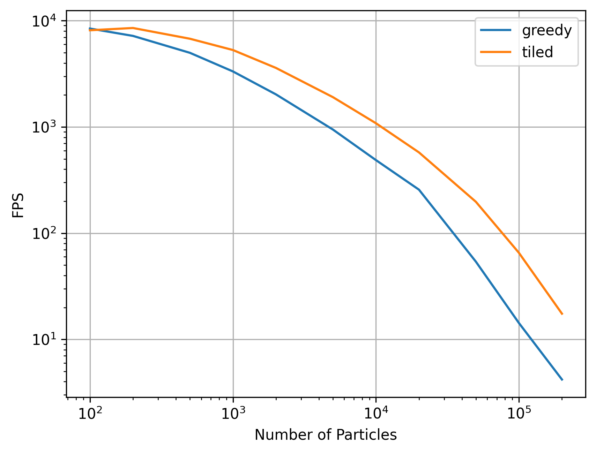

## はじめに
N-bodyシミュレーションをslangで実装します. 今回は実装にSlangpyというライブラリを使用します

実装は [Fast N-Body Simulation with CUDA | GPU Gems 3](https://developer.nvidia.com/gpugems/gpugems3/part-v-physics-simulation/chapter-31-fast-n-body-simulation-cuda) を参考にしています。


## 実装

まず、各実装に共通する部分を見ていきましょう。まずはパーティクルの定義から:
```cpp
struct Particle {
  float mass;       // 質量
  float3 position;  // 位置
  float3 velocity;  // 速度
};
```

次に、パーティクル間の作用を計算する関数を実装します。
particle_iに対するparticle_jからの作用 $f_{ij}$ をparticle_iの質量$m_i$で割ったものは以下のように表されます。

$$
\frac{f_{ij}}{m_i} = \frac{G m_j}{\||r_{ij}\||^2} \frac{r_{ij}}{\||r_{ij}\||}
$$

ここで、$G$は重力定数、$m_i$はparticle_iの質量、$m_j$はparticle_jの質量、$r_{ij}$はparticle_iとparticle_jの距離です。

```cpp
// 重力定数: 今回は1.0にしている
static const float kGravityStrength = 1.0;

void ParticleInteraction(Particle particle, Particle other_particle, inout float3 forces) {
  let r = other_particle.position - particle.position;
  let dist_squared = dot(r, r) + 1.0;  // 定数1.0は0除算を防ぐためのもの
  let dist = sqrt(dist_squared);

  if (dist > 0.1) {
    let inv_dist_cube = 1.0 / (dist_squared * dist);
    let s = kGravityStrength * other_particle.mass * inv_dist_cube;
    forces += r * s;
  }
}
```

次に、各パーティクルからの作用を求めたあとに、自身のアトリビュートを更新を行うための関数を実装します。求められた加速度から、位置と速度を更新します。
```cpp
void UpdateParticle(inout Particle particle, float3 forces, float dt) {
  let acceleration = forces / particle.mass;
  particle.velocity += acceleration * dt;
  particle.position += particle.velocity * dt;
}
```

以上で共通部分の実装は終わりです


### 1. 貪欲に相互作用を計算する
GPUの各スレッドが1つのパーティクルに対する作用を計算します.

```cpp
[shader("compute")]
[numthreads(16, 1, 1)]
void compute_main(uint3 tid: SV_DispatchThreadID) {
  // 1. 対応するパーティクルの取得
  let index = tid.x;
  let num_particles = particles.getCount();
  if (index >= num_particles) {
    // 対応するパーティクルが存在しない場合は処理を終了
    return;
  }
  var particle = particles[index];

  // 2. 相互作用を計算
  var forces = float3(0.0);
  for (int i = 0; i < num_particles; ++i) {
    if (i == index) {
      // 自身に対する作用は計算しない
      continue;
    }
    let other_particle = particles[i];
    ParticleInteraction(particle, other_particle, forces);
  }

  // 3. パーティクルの更新
  UpdateParticle(particle, forces, dt);
  particles[index] = particle;
}
```
とても単純ですが、1つのスレッドがforループを通じてすべてのパーティクルにアクセスを行い、作用を計算するため低速です。


## 結果と考察


- パーティクル数が大きくなればなるほど高速化の効果が大きくなります。
- パーティクル数が小さい時は愚直にやったほうが高速です。
  - これは


## チューニング


## 感想
- N-bodyシミュレーション、愚直にやるよりも共有メモリを使用したほうが高速に演算できる
- slangを簡単に試せるフレームワークとしてのslangpyはとても便利
  - 抽象化されすぎていないのが良い方向に働いている. Graphicsに全く触ったことのない人の入門にもなりそう
  - reflectionが強力

## References
- [Fast N-Body Simulation with CUDA | GPU Gems 3](https://developer.nvidia.com/gpugems/gpugems3/part-v-physics-simulation/chapter-31-fast-n-body-simulation-cuda)