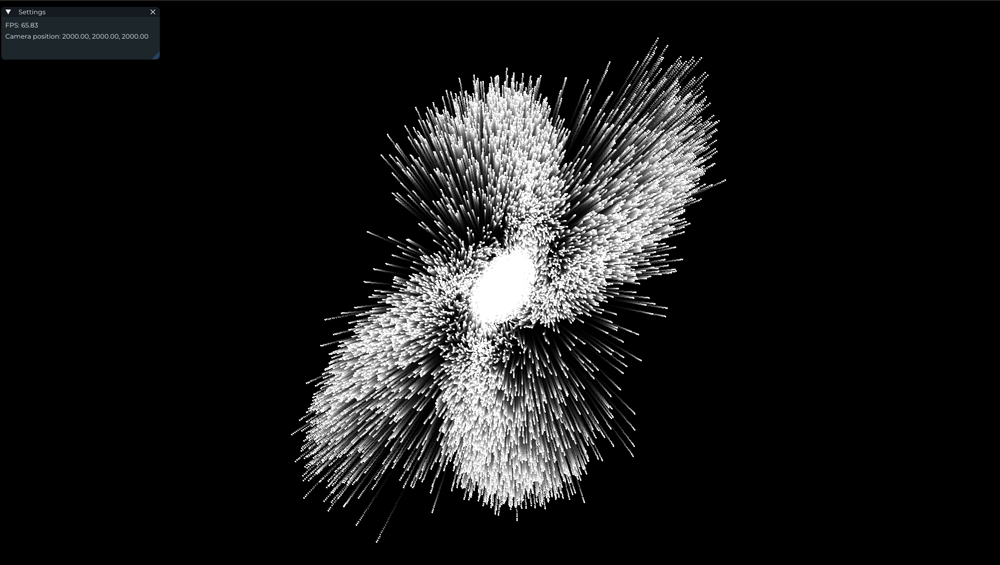

- 100,000個についてのシミュレーションを行った例

## はじめに
N-bodyシミュレーションをslangで実装します. 今回は実装にslangpyというライブラリを使用します

実装は [Fast N-Body Simulation with CUDA | GPU Gems 3](https://developer.nvidia.com/gpugems/gpugems3/part-v-physics-simulation/chapter-31-fast-n-body-simulation-cuda) を参考にしています。

## 実装

まず、各実装に共通する部分を見ていきましょう。まずはパーティクルの定義から:
```cpp
struct Particle {
  float mass;       // 質量
  float3 position;  // 位置
  float3 velocity;  // 速度
};
```

次に、パーティクル間の作用を計算する関数を実装します。
particle_iに対するparticle_jからの作用 $f_{ij}$ をparticle_iの質量$m_i$で割ったものは以下のように表されます。

$$
\frac{f_{ij}}{m_i} = \frac{G m_j}{\||r_{ij}\||^2} \frac{r_{ij}}{\||r_{ij}\||}
$$

ここで、$G$は重力定数、$m_i$はparticle_iの質量、$m_j$はparticle_jの質量、$r_{ij}$はparticle_iとparticle_jの距離です。

```cpp
// 重力定数: 今回は1.0にしている
static const float kGravityStrength = 1.0;

void ParticleInteraction(Particle particle, Particle other_particle, inout float3 forces) {
  let r = other_particle.position - particle.position;
  let dist_squared = dot(r, r) + 1.0;  // 定数1.0は0除算を防ぐためのもの
  let dist = sqrt(dist_squared);

  if (dist > 0.1) {
    let inv_dist_cube = 1.0 / (dist_squared * dist);
    let s = kGravityStrength * other_particle.mass * inv_dist_cube;
    forces += r * s;
  }
}
```

次に、各パーティクルからの作用を求めたあとに、自身のアトリビュートを更新を行うための関数を実装します。求められた加速度から、位置と速度を更新します。
```cpp
void UpdateParticle(inout Particle particle, float3 forces, float dt) {
  let acceleration = forces / particle.mass;
  particle.velocity += acceleration * dt;
  particle.position += particle.velocity * dt;
}
```

以上で共通部分の実装は終わりです


### 1. 貪欲に相互作用を計算する
GPUの各スレッドが1つのパーティクルに対する作用を計算します.

```cpp
[shader("compute")]
[numthreads(16, 1, 1)]
void compute_main(uint3 tid: SV_DispatchThreadID) {
  // 1. 対応するパーティクルの取得
  let index = tid.x;
  let num_particles = particles.getCount();
  if (index >= num_particles) {
    // 対応するパーティクルが存在しない場合は処理を終了
    return;
  }
  var particle = particles[index];

  // 2. 相互作用を計算
  var forces = float3(0.0);
  for (int i = 0; i < num_particles; ++i) {
    if (i == index) {
      // 自身に対する作用は計算しない
      continue;
    }
    let other_particle = particles[i];
    ParticleInteraction(particle, other_particle, forces);
  }

  // 3. パーティクルの更新
  UpdateParticle(particle, forces, dt);
  particles[index] = particle;
}
```
とても単純ですが、1つのスレッドがforループを通じてすべてのパーティクルに別々にアクセスを行い計算するため低速です。

少し解説をしておくと、今回はcompute shaderをスレッドグループ = (16, 1, 1)で実行しています。
`SV_DispatchThreadID`は現在のスレッドがディスパッチ全体の中で何番目かを表しています。
例えば、これをgroup = (8, 1, 1) で実行した場合、(16 * 8, 1, 1) -> 128個のスレッドが起動しその中の一意の値が`SV_DispatchThreadID`に入るというわけです。
このコードでは実行時にパーティクル数以上のスレッドが起動することを前提としています。

他にも似たようなセマンティクスとしていくつか紹介しておくと、
- `SV_GroupThreadID`: スレッドグループの中で何番目のスレッドか
  - 今回だと (0, 0, 0) から (15, 0, 0) までの値を取る
- `SV_GroupIndex`: 現在のスレッドがグループの中で何番目かを表しています。
  - `SV_GroupThreadID`について一意の値を取る
  - 今回だと 0 - 15 
- `SV_GroupID`: 現在のスレッドがグループの中で何番目かを表しています。
  - 今回だと 0 - 7 の値を取る (groupを(8, 1, 1)にした場合)


まとめとしては[こちら](https://learn.microsoft.com/ja-jp/windows/win32/direct3dhlsl/sv-dispatchthreadid) の図がわかりやすいです。


### 2. タイルごとに相互作用を計算する
タイルごとに計算することで高速化が期待できます。まずはコード全体を見てみましょう。

```cpp

// タイルのサイズ: 今回は256個で決め打ち
static const uint kTileSize = 256;

// タイル内のパーティクルを格納する共有メモリ
groupshared Particle tile_particles[kTileSize];

[shader("compute")]
[numthreads(kTileSize, 1, 1)]
void compute_main(uint3 tid: SV_DispatchThreadID, uint3 gtid: SV_GroupThreadID) {
  // 1. 対応するパーティクルの取得

  // 対応するパーティクルのインデックス. x は [0, num_particles - 1] の値を取る
  let index = tid.x;

  // thread groupの中で何番目のスレッドか. x は [0, kTileSize - 1] の値を取る
  let group_thread_id = gtid.x;
  let num_particles = particles.getCount();
  if (index >= num_particles) {
    return;
  }
  var particle = particles[index];

  // 2. タイルの読み込み
  var forces = float3(0.0);

  // 3. タイルごとに相互作用を計算するためのループ
  [unroll]
  for (uint tile_start = 0; tile_start < num_particles; tile_start += kTileSize) {
    uint load_index = tile_start + group_thread_id;
    if (load_index < num_particles) {
      // 共有メモリに読み込み
      tile_particles[group_thread_id] = particles[load_index];
    }

    // アクセスする前に同期を取る
    GroupMemoryBarrierWithGroupSync();

    // 3.1. タイル内のパーティクルについて計算
    [unroll]
    for (uint tile_offset = 0;
         tile_offset < kTileSize && (tile_start + tile_offset) < num_particles; ++tile_offset) {
      if (tile_start + tile_offset != index) {  // 自身に対する作用は計算しない
        ParticleInteraction(particle, tile_particles[tile_offset], forces);
      }
    }

    // ここに到達する前に次のループに行くのを防ぐ
    GroupMemoryBarrierWithGroupSync();
  }

  // 4. パーティクルの更新
  UpdateParticle(particle, forces, dt);
  particles[index] = particle;
}
```

注意するところは `GroupMemoryBarrierWithGroupSync()` でしょうか。似たような関数がいくつかあるので混乱しないようにしたいです
- `DeviceMemoryBarrierWithGroupSync`: デバイスメモリ (!= 共有メモリ) へのアクセスに対する同期
- `AllMemoryBarrierWithGroupSync`: すべてのメモリへのアクセスに対する同期
- `GroupMemoryBarrierWithWaveMaskSyncMask`: Waveについての共有メモリへのマスク付きの同期 (CUDAの`__syncwarp`に相当するもの)

などなど... 使い分けたいですね

さて、このコードで高速化が可能なのは3.1で行っている共有メモリアクセスのおかげです。一度共有メモリに読み込んでおくことで、あとの複数回のアクセスを速くすることができるという仕組みになっています。

## 結果
まずは20個ほど出してみてどんな軌道を描くか見てみましょう


とても高速に計算・描画できていることがわかりますね。さて、パーティクルを増やしていったときのそれぞれのfpsを見ていきましょう。


- パーティクル数が大きくなればなるほど共有メモリによる高速化の影響が大きくなる
- パーティクル数が小さい時は愚直にやったほうが高速
  - これは、パーティクル数がkTiledSizeよりも小さい場合にオーバーヘッドが出ているものと考えられます


## 感想
- N-bodyシミュレーション、愚直にやるよりも共有メモリを使用したほうが高速に演算できることを実装を通して確認できた
- slangを簡単に試せるフレームワークとしてのslangpyはとても便利
  - 抽象化されすぎていないのが良い方向に働いている. グラフィクスに全く触ったことのない人の入門にもなりそう
  - reflectionが強力

今回のレポジトリは[tsumli/slang-particles](https://github.com/tsumli/slang-particles)にあります。ぜひ覗いてみてください


## References
- [Fast N-Body Simulation with CUDA | GPU Gems 3](https://developer.nvidia.com/gpugems/gpugems3/part-v-physics-simulation/chapter-31-fast-n-body-simulation-cuda)